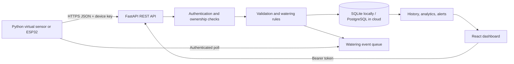

# Architecture and cloud computing map

## End-to-end flow

1. A user registers or signs in. The API hashes passwords using PBKDF2-SHA256 and issues a signed, expiring bearer token.
2. The owner creates a device. The API creates a cryptographically random device key, stores only its SHA-256 digest, and returns the key once.
3. The simulator sends a timezone-aware reading over HTTPS/REST with `X-Device-Key`. The API checks the device identity, bounds, timestamp, and event ID before writing.
4. A unique `(device_id, event_id)` constraint and pre-check make retries idempotent. Threshold logic can queue one bounded watering pulse if automatic mode is enabled, the tank has water, and cooldown has elapsed.
5. The sensor polls its authenticated action endpoint, consumes queued actions once, and simulates the pump response. Physical firmware uses the same API contract plus its own electrical and run-time interlocks.
6. The dashboard fetches latest state/history, refreshes every ten seconds, displays alerts, and lets only the owner change thresholds, acknowledge alerts, or request manual watering.

## Concepts demonstrated

| Cloud concept | Where it appears | Production-scale extension |
|---|---|---|
| Cloud computing / SaaS | Remotely accessible plant dashboard and API | Multi-tenant managed service |
| PaaS | Vercel hosting and managed PostgreSQL | Separate autoscaling API and worker services |
| IaaS | Not provisioned in this MVP | VM/container cluster, private network, object storage |
| IoT-to-cloud / REST | Device-key protected JSON ingestion and polling | MQTT broker and topic ACLs |
| Cloud database / time-series | PostgreSQL readings indexed by device and time | TimescaleDB/Timestream/Bigtable plus retention and aggregates |
| Serverless / event-driven | Vercel Python request function and queued action records | Functions triggered from queues/streams |
| Authentication / authorization | Signed user token, per-device secret, row ownership checks | Managed OIDC, short-lived device certificates, RBAC |
| API gateway | FastAPI routes and validation | Gateway/WAF, quotas, request throttling |
| Elasticity / availability | Stateless API runtime and managed storage model | Regional replicas, autoscaling, queues and retry budgets |
| Secrets | Runtime environment variables; no committed credentials | Cloud secret manager and scheduled rotation |
| Logging / monitoring | Structured service logs and `/api/health` | Metrics, traces, dashboards, SLO alerts |
| CI/CD | Build and test commands in repo | GitHub Actions checks and Vercel preview/production promotion |

## Growth path

- **10 devices:** a small managed PostgreSQL instance and one stateless API deployment are enough.
- **1,000 devices:** apply per-device quotas, connection pooling, database indexes, async work queues, and retention/aggregation policies.
- **100,000 devices:** use an IoT broker or regional ingestion gateway, partitioned time-series storage, queue consumers, and read replicas/caches for dashboard queries.
- **1,000,000 readings:** batch/stream ingestion, cold storage for raw data, rollups for charts, TTL policies, back-pressure, observability, and capacity tests prevent unbounded cost or storage growth.

When thousands of nodes report together, the gateway applies quotas and the broker/queue absorbs bursts. Workers process with bounded concurrency and database pools; retries use exponential backoff with jitter. Device timestamps are retained separately from server receive time so clock drift and delayed/offline uploads can be analyzed.
